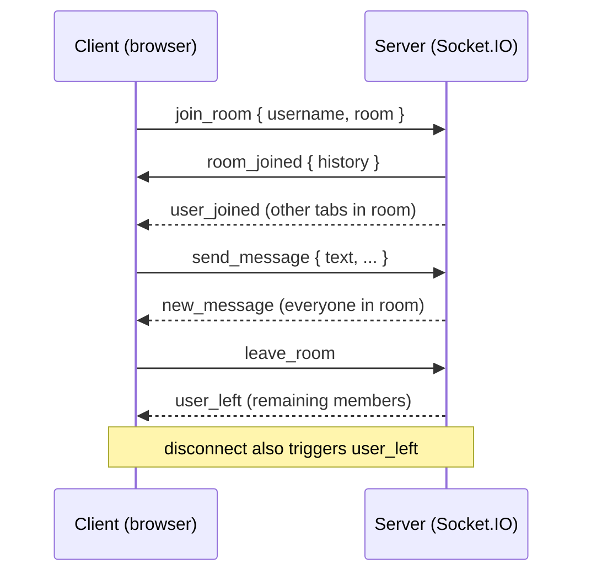

# Student Manual — Socket.IO Chat (hands-on)

Use this guide on the **`start`** branch (same as `main`). The repo already includes the React UI, Express server, Socket.IO wiring, and shared event names/types. Your job is to implement the real-time chat event flow.

## Before you start

1. Check out the starter branch:

   ```bash
   git checkout start
   ```

2. Install dependencies from the repo root:

   ```bash
   npm install
   ```

3. Copy environment defaults and run both apps:

   ```bash
   cp .env.example .env
   npm run dev
   ```

4. Open `http://localhost:5173`. You should see the join form and a **Connected** badge once the socket connects.

5. Search the codebase for `STEP` — each step below matches a `STEP N TODO` comment in the source.

## Branches

| Branch  | Purpose |
| ------- | ------- |
| `start` / `main` | Where you implement the exercise (TODOs in place). |
| `final` | Completed reference solution after the session. |

## What you are building (big picture)



## Event contract

Defined in [`packages/shared/src/socket-events.ts`](packages/shared/src/socket-events.ts):

| Event | Direction | Purpose |
| ----- | --------- | ------- |
| `join_room` | client → server | Enter a named room. |
| `room_joined` | server → client | Acknowledge join; includes chat history. |
| `user_joined` | server → room | Someone else entered. |
| `leave_room` | client → server | Leave without disconnecting the socket. |
| `user_left` | server → room | Someone left or disconnected. |
| `send_message` | client → server | Post a chat message. |
| `new_message` | server → room | Broadcast a message to the room. |
| `error_message` | server → client | Validation / session errors (optional in starter). |

Socket.IO also provides built-in `connect` and `disconnect` events (already wired in the starter).

## Recommended task order

| Order | Step | File | What you implement |
| ----- | ---- | ---- | ------------------ |
| 1 | Server memory | `apps/server/src/socket.ts` | Session map + per-room history |
| 2 | `join_room` | `apps/server/src/socket.ts` | Join handler |
| 3 | `leave_room` | `apps/server/src/socket.ts` | Explicit leave |
| 4 | `send_message` | `apps/server/src/socket.ts` | Message broadcast + history |
| 5 | `disconnect` | `apps/server/src/socket.ts` | Cleanup on tab close |
| 6 | Join (client) | `apps/client/src/App.tsx` | Emit join + handle `room_joined` |
| 7 | Leave (client) | `apps/client/src/App.tsx` | Emit leave + reset UI state |
| 8 | Connect toggle | `apps/client/src/App.tsx` | `socket.connect()` / `disconnect()` |
| 9 | Send (client) | `apps/client/src/components/ChatPanel.tsx` | Emit `send_message` |
| 10 | Listen (client) | `apps/client/src/App.tsx` | `new_message`, presence, errors |
| 11 | Render UI | `apps/client/src/components/ChatPanel.tsx` | Message list |
| 12 | Error banner | `apps/client/src/components/ChatPanel.tsx` | Show `error_message` |
| 13 | Test | two browser tabs | End-to-end checklist below |

Do the server steps (1–5) before the client steps so you can test with logging on the server console.

---

## Step 1 — Server: in-memory state

**File:** `apps/server/src/socket.ts`  
**Find:** `// STEP 1 TODO:`

Create:

- A structure to remember each socket’s current `{ username, room }` (a `Map` keyed by socket id works well).
- A `Map<string, ChatMessage[]>` (or similar) for per-room chat history.

Keep it in memory only — no database, no auth library.

Import what you need from `@chat/shared` and `randomUUID` from `node:crypto` (used in step 4).

---

## Step 2 — Server: `join_room`

**File:** `apps/server/src/socket.ts`  
**Find:** `// STEP 2 TODO:`

Inside `io.on(SOCKET_EVENTS.CONNECTION, (socket) => { ... })`, add `socket.on(SOCKET_EVENTS.JOIN_ROOM, ...)`.

1. Read `{ username, room }` from the payload.
2. Store the session for this socket id.
3. `socket.join(room)`.
4. Emit `SOCKET_EVENTS.ROOM_JOINED` to this socket with `{ username, room, history: ... }`.
5. `socket.to(room).emit(SOCKET_EVENTS.USER_JOINED, { room, username })` so others are notified.

**Tip:** If a socket joins a second room, leave the previous room first so a client is only ever in one room.

---

## Step 3 — Server: `leave_room`

**File:** `apps/server/src/socket.ts`  
**Find:** `// STEP 3 TODO:`

Add `socket.on(SOCKET_EVENTS.LEAVE_ROOM, ...)`.

1. Look up the stored room for this socket.
2. `socket.leave(room)` — do **not** call `socket.disconnect()`.
3. Broadcast `SOCKET_EVENTS.USER_LEFT` to remaining members.
4. Clear this socket’s session entry.

---

## Step 4 — Server: `send_message`

**File:** `apps/server/src/socket.ts`  
**Find:** `// STEP 4 TODO:`

Add `socket.on(SOCKET_EVENTS.SEND_MESSAGE, ...)`.

1. Read `{ username, room, text }`.
2. Build a `ChatMessage` with `id: randomUUID()` and `createdAt: new Date().toISOString()`.
3. Append to that room’s history.
4. `io.to(room).emit(SOCKET_EVENTS.NEW_MESSAGE, message)`.

---

## Step 5 — Server: `disconnect`

**File:** `apps/server/src/socket.ts`  
**Find:** `// STEP 5 TODO:` inside the existing `DISCONNECT` handler.

If this socket was still in a room, broadcast `USER_LEFT` and remove its session entry. This covers closed tabs, refresh, and the **Disconnect** button.

---

## Step 6 — Client: join flow

**File:** `apps/client/src/App.tsx`  
**Find:** `// STEP 6 TODO:` in `handleJoin`.

1. Emit `SOCKET_EVENTS.JOIN_ROOM` with `values`.
2. In the top `useEffect`, listen for `SOCKET_EVENTS.ROOM_JOINED`:
   - Set joined state (move `setJoined(true)` here instead of calling it before the server ack).
   - Seed messages from `payload.history`.
   - Add a system line like `You joined #${room} as ${username}`.

Import `SOCKET_EVENTS` (and payload types if you want strict typing) from `@chat/shared`.

---

## Step 7 — Client: leave flow

**File:** `apps/client/src/App.tsx`  
**Find:** `// STEP 7 TODO:` in `handleLeave`.

1. Emit `SOCKET_EVENTS.LEAVE_ROOM` with `{ room, username }`.
2. Clear message state and return to the join form (`setJoined(false)`).

---

## Step 8 — Client: connect / disconnect button

**File:** `apps/client/src/App.tsx`  
**Find:** `// STEP 8 TODO:` in `handleToggleConnection`.

- If `socket.connected`, call `socket.disconnect()`.
- Otherwise call `socket.connect()`.

After a disconnect, require the user to join a room again (the server no longer associates them with a room).

---

## Step 9 — Client: send message

**File:** `apps/client/src/components/ChatPanel.tsx`  
**Find:** `// STEP 9 TODO:` in `handleSend`.

Emit `SOCKET_EVENTS.SEND_MESSAGE` with `{ room, username, text: draft.trim() }`. Keep the empty-message guard.

Import `SOCKET_EVENTS` and the shared `socket` from `../lib/socket.js`.

---

## Step 10 — Client: listen for chat events

**File:** `apps/client/src/App.tsx`  
**Find:** `// STEP 10 TODO:` in the main `useEffect`.

Add listeners (and clean them up in the effect’s return function) for:

- `SOCKET_EVENTS.NEW_MESSAGE` — append to message state.
- `SOCKET_EVENTS.USER_JOINED` / `USER_LEFT` — append short system messages.
- `SOCKET_EVENTS.ERROR_MESSAGE` — store an error string for the banner.

Hold messages in React state in `App.tsx` and pass them (and the error) into `ChatPanel` as props.

---

## Step 11 — Client: render the message list

**File:** `apps/client/src/components/ChatPanel.tsx`  
**Find:** `// STEP 11 TODO:` above `.messages`.

Replace the placeholder with a `.map(...)` over the messages you receive from `App`.

Render chat lines and system lines differently (the starter CSS includes `message--system`).

---

## Step 12 — Client: error banner

**File:** `apps/client/src/components/ChatPanel.tsx`  
**Find:** `// STEP 12 TODO:`

When `error` prop is set, show a visible banner; clear it when appropriate (e.g. on successful join).

---

## Step 13 — Test with two browser tabs

With `npm run dev` running, open `http://localhost:5173` in **two tabs**.

| # | Action | Expected |
| - | ------ | -------- |
| 1 | Join the same room with different usernames | Both see join system messages |
| 2 | Send from tab A | Tab B receives the message immediately |
| 3 | Send from tab B | Tab A receives it |
| 4 | **Leave** in tab B | Tab A sees “left” system message |
| 5 | Rejoin tab B | Tab B receives prior room **history** |
| 6 | **Disconnect** then **Connect** in one tab | User must join again; others see `user_left` |

Also run once:

```bash
npm run typecheck
npm run build
```

Both should pass before you consider the exercise done.

---

## What not to build (during the lecture)

- Authentication or accounts
- Database persistence
- Typing indicators, DMs, edits, deletes
- Production deployment

Focus on rooms, broadcasts, and client/server event flow.

---

## After the session

Compare your work with the reference implementation:

```bash
git fetch origin
git checkout final
npm install
npm run dev
```

The `final` branch adds Zod validation in `packages/shared/src/socket-schemas.ts` and a small `RoomHistory` helper — optional patterns to study after the core flow works.

---

## Getting unstuck

| Symptom | Things to check |
| ------- | ---------------- |
| Join does nothing | Server handler registered? Correct event name from `SOCKET_EVENTS`? |
| Only sender sees messages | Using `io.to(room)` / `socket.to(room)` instead of `socket.emit`? |
| `user_left` missing on tab close | Step 5 disconnect handler clearing session? |
| CORS / connection errors | `.env` copied? Server on `:3000`, client on `:5173`? |
| TypeScript errors | Import types from `@chat/shared`; run `npm run typecheck` |

Ask your instructor to diff your branch against `final` if you are blocked.
